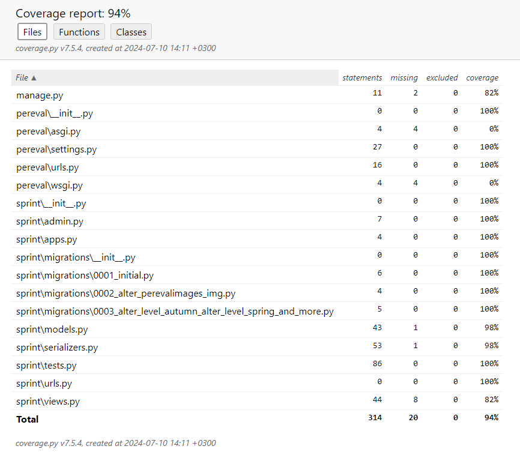

Виртуальная стажировка
Pereval Rest API
Федерации спортивного туризма России pereval.online (далее - ФСТР) заказала студентам SkillFactory разработать мобильное приложение для Android и IOS, которое упростило бы туристам задачу по отправке данных о перевале и сократило время обработки запроса до трёх дней.
Пользоваться мобильным приложением будут туристы. В горах они будут вносить данные о перевале в приложение и отправлять их в ФСТР, как только появится доступ в Интернет.
Модератор из федерации будет верифицировать и вносить в базу данных информацию, полученную от пользователей, а те в свою очередь смогут увидеть в мобильном приложении статус модерации и просматривать базу с объектами, внесёнными другими.

Турист с помощью мобильного приложения будет передавать в ФСТР следующие данные о перевале:
    • Информацию о себе:
        ◦ Фамилия;
        ◦ Имя;
        ◦ Отчество;
        ◦ Электронная почта;
        ◦ Номер телефона.
    • Название объекта;
    • Координаты объекта и его высоту;
    • Уровень сложности в зависимости от времени года;
    • Несколько фотографий.
После этого турист нажимает кнопку «Отправить» в мобильном приложении. Мобильное приложение вызовет метод Pereval.
Метод:
POST/submitData/
принимает JSON в теле запроса с информацией о перевале. Пример JSON-а:

{ 
"beauty_title": "гора", 
"title": "Эверест", 
"other_title": "Джомолунгма", 
"connect": "Соединяет Непал и Тибет", 
"user": { 
"email": "example@mail.com", 
"fam": "Иванов", 
"name": "Иван", 
"otc": "Иванович", 
"phone": "+1234567890" 
},
"coord": {
 "latitude": 27.9881, 
"longitude": 86.9250, 
"height": 8848 
}, 
"level": { 
"winter": "2A", 
"summer": "3A", 
"autumn": "2A", 
"spring": "3A"
 }, 
"images": [
   { 
"title": "Вид на вершину", 
"img": "https://example.com/everest1.jpg" 
   }, 
   { 
"title": "Базовый лагерь", 
"img": "https://example.com/everest2.jpg"
   } 
 ] 
} 
Результат метода: JSON
    • status — код HTTP, целое число:
      500 — Ошибка при выполнении операции;
      400 — Некорректный запрос (при нехватке полей);
      200 — Отправлено успешно.
    • message — строка:
      Причина ошибки (если она была);
      Отправлено успешно;
      Если отправка успешна, дополнительно возвращается id вставленной записи.
      id — идентификатор, который был присвоен объекту при добавлении в базу данных.
Примеры oтветов:
{
    "status": 400,
    "message": "Некорректный запрос",
    "id": null
}

    "status": 200,
    "message": "Отправлено успешно",
    "id": 3
}

После того, как турист добавит в базу данных информацию о новом перевале, сотрудники ФСТР проведут модерацию для каждого нового объекта и поменяют поле status.
Допустимые значения поля status:
    • 'new'; ( Автоматическое заполнение)
    • 'pending' — модератор взял в работу;
    • 'accepted' — модерация прошла успешно;
    • 'rejected' — модерация прошла, информация не принята.

Метод:
GET /submitData/<id>
получает одну запись (перевал) по её id с выведением всей информацию об перевале, в том числе статус модерации.

Метод:
PATCH /submitData/<id>
позволяет отредактировать существующую запись (замена), при условии что она в статусе "new". При этом редактировать можно все поля, кроме тех, что содержат ФИО, адрес почты и номер телефона. В качестве результата изменения приходит ответ содержащий следующие данные:
state: 1 — если успешно удалось отредактировать запись в базе данных. 0 — в отредактировать запись не удалось.
message: сообщение о причине неудачного обновления записи.

Метод:
GET /submitData/?user_id__email=<email>
позволяет получить данные всех объектов, отправленных на сервер пользователем с почтой.
В качестве реализации использована фильтрация по адресу электронной почты пользователя с помощью пакета django-filter

Документация сгенерирована с помощью пакета drf-yasg
Документация swagger: http://127.0.0.1:8000/swagger/

Документация redoc: http://127.0.0.1:8000/redoc/

URLS:

Дополнительно:
    1. Реализовано повторное использование существующего объекта модели PassUser при создания нового объекта модели Pereval. Если запрос (метод POST/Pereval/) на добавление записи отправляет пользователь, ранее уже отправлявший такой запрос (определяется по всем данным пользователя), то для текущей записи используются ранее записанные данные пользователя, а не создается новый пользователь (объект модели PassUser).
    2. Для создания и изменения объектов моделей со связанными данными вложенных сериализаторов использован пакет drf-writable-nested

Проект опубликован на хостинге pythonanywhere.com
API Pereval: https://olegafonick.pythonanywhere.com/Pereval/
Документация swagger: https://olegafonick.pythonanywhere.com/swagger/
Документация redoc: https://olegafonick.pythonanywhere.com/redoc/

