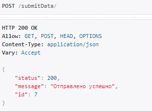
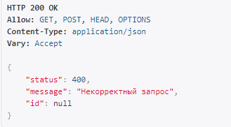
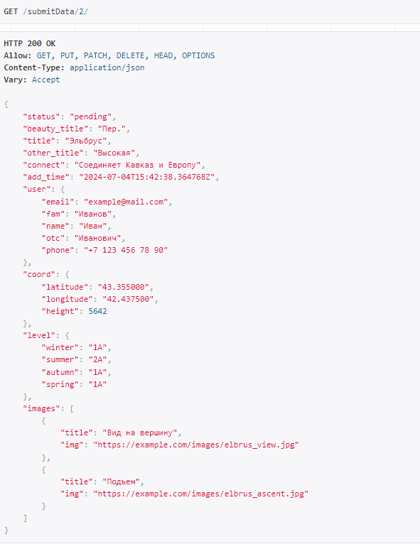
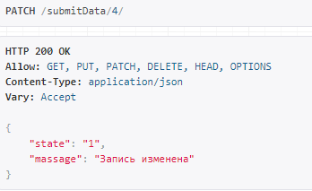
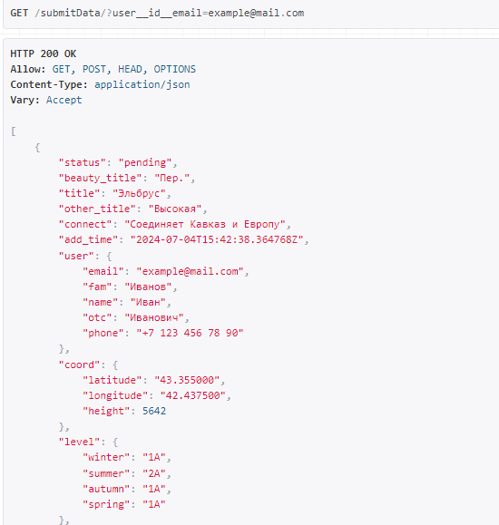
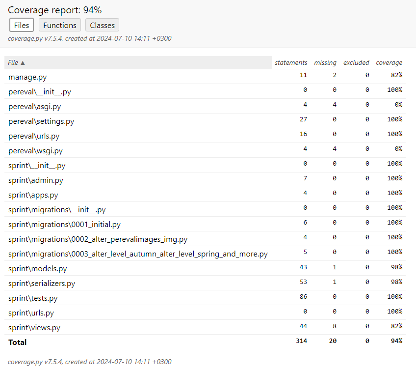

Федерации спортивного туризма России [pereval.online](https://pereval.online) (далее - ФСТР) заказала студентам SkillFactory разработать мобильное приложение для Android и IOS, которое упростило бы туристам задачу по отправке данных о перевале и сократило время обработки запроса до трёх дней.

Пользоваться мобильным приложением будут туристы. В горах они будут вносить данные о перевале в приложение и отправлять их в ФСТР, как только появится доступ в Интернет.
Модератор из федерации будет верифицировать и вносить в базу данных информацию, полученную от пользователей, а те в свою очередь смогут увидеть в мобильном приложении статус модерации и просматривать базу с объектами, внесёнными другими.
___
*Турист с помощью мобильного приложения будет передавать в ФСТР следующие данные о перевале:*
+ ***Информацию о себе:***
  + ***Фамилия;***
  + ***Имя;***
  + ***Отчество;***
  + ***Электронная почта;***
  + ***Номер телефона.***
+ ***Название объекта;***
+ ***Координаты объекта и его высоту;***
+ ***Уровень сложности в зависимости от времени года;***
+ ***Несколько фотографий.***
*После этого турист нажимает кнопку «Отправить» в мобильном приложении. Мобильное приложение вызовет метод **Pereval**.*
 ***Метод:***
 
```
POST/submitData/
```
 
 *принимает JSON в теле запроса с информацией о перевале. Пример JSON-а:*
```
{
            "beauty_title": "Пример",
            "title": "Обновленный перевал",
            "other_title": "Еще пример",
            "connect": "Описание соединения",
            "user": {
                "email": "test@example.com",
                "fam": "Иванов",
                "name": "Иван",
                "otc": "Иванович",
                "phone": "1234567890"
            },
            "coord": {
                "latitude": "45.384200",
                "longitude": "7.152500",
                "height": 1200
            },
            "level": {
                "winter": "1A",
                "summer": "1A",
                "autumn": "1A",
                "spring": "1A"
            },
            "images": [
                {
                    "title": "Седловина",
                    "img": "https://example.com/image1.jpg"
                },
                {
                    "title": "Подъем",
                    "img": "https://example.com/image2.jpg"
                }
            ]
        }
```
***Результат метода: JSON***
+ *status — код HTTP, целое число:*
 
    *500 — ошибка при выполнении операции;*
    
    *400 — Bad Request (при нехватке полей);*
    
    *200 — Отправлено успешно.*
+ 
    
+ *message — строка:*
   *Причина ошибки (если она была);*
    
    *Отправлено успешно;*
    
    *Если отправка успешна, дополнительно возвращается id вставленной записи.*
    
    *id — идентификатор, который был присвоен объекту при добавлении в базу данных.*
    
    
***Примеры oтветов:***
`{ "status": 500, "message": "Ошибка подключения к базе данных","id": null}`
`{ "status": 200, "message": null, "id": 42 }`
*После того, как турист добавит в базу данных информацию о новом перевале, сотрудники ФСТР проведут модерацию для каждого нового объекта и поменяют поле status.*
***Допустимые значения поля status:***
+ *'new';*
+ *'pending' — модератор взял в работу;*
+ *'accepted'  — модерация прошла успешно;*
+ *'rejected' — модерация прошла, информация не принята.*
______
 ***Метод:*** 
```
GET /submitData/<id>
```
*получает одну запись (перевал) по её id с выведением всей информацию об перевале, в том числе статус модерации.*

____
***Метод:***
```
PATCH /submitData/<id>
```
*позволяет отредактировать существующую запись (замена), при условии что она в статусе "new". При этом редактировать можно все поля, кроме тех, что содержат ФИО, адрес почты и номер телефона. В качестве результата изменения приходит ответ содержащий следующие данные:*
 *state:*
     *1 — если успешно удалось отредактировать запись в базе данных.*
     *0 — в отредактировать запись не удалось.*
    
 *message: сообщение о причине неудачного обновления записи.*
 
_____
***Метод:***
   
```
GET /submitData/?user_id__email=<email>
```
*позволяет получить данные всех объектов, отправленных на сервер пользователем с почтой.* 
В качестве реализации использована фильтрация по адресу электронной почты пользователя с помощью пакета **django-filter**

______
***Документация сгенерирована с помощью пакета `drf-yasg`*** 
*Документация **swagger**: http://127.0.0.1:8000/swagger/*<br/>
*Документация **redoc**: http://127.0.0.1:8000/redoc/*
______

***Проект опубликован на хостинге pythonanywhere.com***
*API **Pereval**: *<br/>
*Документация **swagger**: <br/>*
*Документация **redoc**: *
______
***Отчет о покрытии тестами:***
